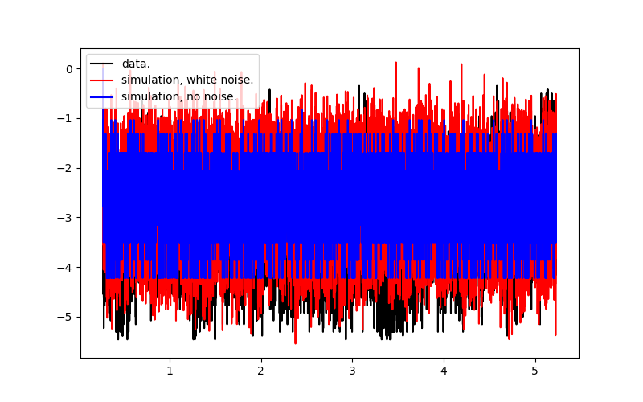

# Repository.

Single channel modelling of ion channels - classical data science.

# Background. 

Recordings of a few ion channels' electrical activity on cell (smooth muscle cells) membrane surface contain information regarding channel-channel interaction under pathophysiological conditions. Markov chain modelling is used to uncover the coupling in this repo.

# Dependencies.

This algorithm works on python3. Since ion channel recordings are often saved using proprietary software, the files may need to be 
read using suitable library. For examply, abf files created by the patch clamp rig here in UWO labs needs the use of pyABF library.

# Install.

None.

# Sources and data description.

## Data.

The data belongs to collaborators. It essentially consists of single channel patch clamp recordings that has time, clamp voltage, and recorded electrical voltage signal.

## Source.

The single python program, MLE.py uses following dynamic programming algorithms I implemented from scratch:
* Data analysis to estimate number of ion channels in the patch, data standard deviation, and transition matrix eigenvalue.
* Emission matrix and forward/backward algorithm to estimate transition matrix from data.
* Viterbi algorithm to estimate the most likely transition sequence.
* Steepest gradient method to estimate the coupling parameter in the transition matrix.

The efficacy of the code can be seen in the figure below where experimental data (black line), simulated noisy signal (red line), and estimate Markov chain (blue) became quite close to each other within 3 to 5 iterations.  

# Use.

python3 mle.py

# Uptake by other users.

This program will be used in 2023 for a study being undertaken in Robarts Institute, Western University.

# Maintainer.

This program is under development. SR Kharche. It can be used for all applications of Markov chains beyond the use in ion channel research.

# Acknowledements.

This project was generously funded by CANARIE Inc. Canada (April 2020 to March 2023). 

# Licence.

This program cannot be shared at the moment.

## Dr. Sanjay R. Kharche, Ph.D. (App. Maths).  
January 23rd, 2023.  
Email: Sanjay.Kharche@lhsc.on.ca , skharche@uwo.ca , srk.london@yahoo.com .  
Phone: +15198780685 (mobile).  
Website: https://kcru.lawsonresearch.ca/research/srk/index.html  

